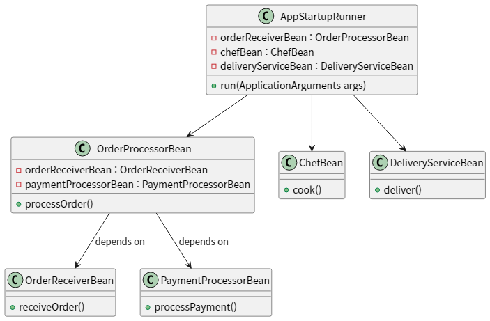

# Spring Boot Study 

## Day 01. 의존성 주입 (DI)
- 주문 처리 Bean (OrderProcessorBean)
    - 주문 처리 Bean 은 주문 받는 Bean 과 결제하는 Bean 을 의존성 주입 받아서 단계대로 실행한다.

- 주문 받는 Bean (OrderReceiverBean)
    - 주문을 받는다는 출력을 한다.

- 결제하는 Bean (PaymentProcessorBean)
    - 결제 처리를 한다 는 출력을 한다.

- 요리하는 Bean (ChefBean)
    - 요리 한다 는 출력을 한다.

- 배달하는 Bean (DeliveryServiceBean)
    - 배달 한다 는 출력을 한다.

